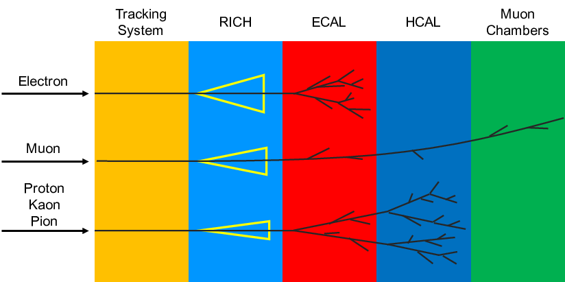

# Домашнее задание № 7

## Машинное обучение

В этом задании нужно применить пакет [TensorFlow](https://www.tensorflow.org) для классификации событий (частиц) в эксперименте LHCb.
> **В данном задании необходимо использовать версию `tensorflow==2.15`.** Это связано с тем, что в пакет `tf2onnx` пока не добавили поддержку более новых версий `tensorflow`.

Используйте набор данных доступный по ссылке [https://github.com/hse-aml/hadron-collider-machine-learning/releases/download/Week_2/training.csv.gz](https://github.com/hse-aml/hadron-collider-machine-learning/releases/download/Week_2/training.csv.gz), сохраните его в файле `training.csv.gz`. Загружать этот файл в репозиторий не нужно, он слишком большой.
Разбейте набор данных на тренировочный, валидационный и тестовый в пропорциях по своему усмотрению.
Используйте тренировочный набор для обучения модели, валидационный набор для подбора гиперпараметров, а тестовый для оценки качества финальной модели.



> Физические подробности эксперирмента можно узнать в [оригинальном исследовании](https://iopscience.iop.org/article/10.1088/1748-0221/3/08/S08005/pdf)

**Дедлайн 12 июня 23:55**

В файле `particles.py` находится пример кода, реализующий многоклассовый классификатор с использованием нейросетей.
Кроме того, код сохраняет готовую модель в переносимом формате [ONNX](https://onnx.ai) в файл с названием `particles.onnx`.

> В файле `predict.py` содержится пример кода, как можно использовать готовую модель в формате ONNX. Пример использует тестовый набор данных [https://github.com/hse-aml/hadron-collider-machine-learning/releases/download/Week_2/test.csv.gz](https://github.com/hse-aml/hadron-collider-machine-learning/releases/download/Week_2/test.csv.gz) без меток классов. У проверяющих задание есть файл с метками для независимой оценки качества вашей модели из файла `particles.onnx`.

Ваша задача модифицировать нейросетевую модель таким образом, чтобы показатель ROC AUC для случая «электрон против всего остального» был больше **0.97** на вашей тестовой выборке.

* В файле `roc.png` изобразите графики кривых ROC для каждого типа частицы.
* В файле `train.png` изобразите кривую обучения: зависимость значения функции потерь от номера эпохи.
* В файле `confusion.png` изобразите матрицу ошибок классификации.
* В файле `particles.json` запишите метрики качества вашей финальной модели в следующем формате:
```
{
"test_auc": {
    "Electron": 0.01,
    "Ghost": 0.01,
    "Kaon": 0.01,
    "Muon": 0.01,
    "Pion": 0.01,
    "Proton": 0.01,
}
}
```
* **Не забудьте загрузить** файл `particles.onnx` с вашей финальной обученной моделью в репозиторий с заданием, вместе с кодом.

*Мега-бонусное задание*
В файле `particles_pytorch.py` решите ту же задачу, с примнением [`pytorch`](https://pytorch.org/), другого фреймворка для работы с нейронными сетями.
